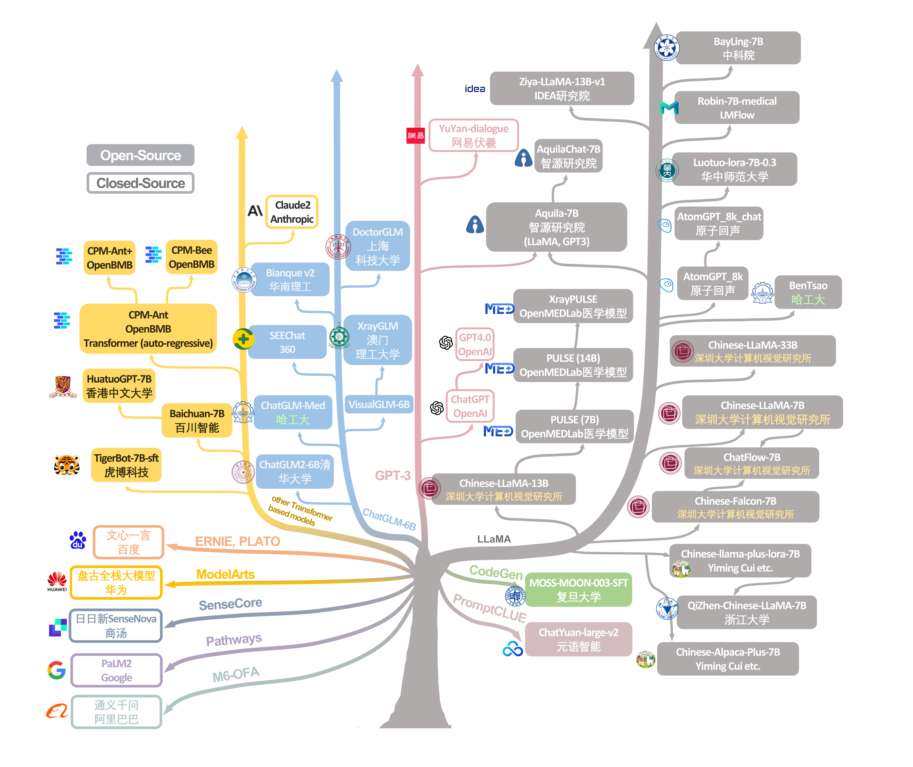

# Evaluating Large Language Models for Radiology Natural Language Processing

by Zhengliang Liu, Tianyang Zhong, Yiwei Li, Yutong Zhang, Yi Pan, Zihao Zhao, Peixin Dong, et al.<br/>

[](https://arxiv.org/abs/2305.15964)

<div align="center">
  
</div>

## Introduction

This is the official implementation of paper: Evaluating Large Language Models for Radiology Natural Language Processing.

Our research centers on a pivotal aspect of radiology Natural Language Processing (NLP), specifically the interpretation of radiology reports and the extraction of impressions from radiologic observations. We conduct a thorough evaluation of the chosen models utilizing two widely adopted datasets of radiology reports, assessing their performance through a range of metrics.

## Usage

- Switch to your LLM: Change corresponding code in eval.py to prepare your tokenizer, model and generation_config
- To implement it on a cluster, you need to implement LLM.sh and modify it based on your condition
- All data has been well prepared in this repo, just clone this repo
- Now only support ImpressionGPT, the results from LLM will be recorded in the ''pseudo_impression'' column of the csv file

Implement Ziya-13B on ImpressionGPT

- sbatch LLM.sh MIMIC-EN.csv Ziya-13B ImpressionGPT
- sbatch LLM.sh MIMIC-ZH.csv Ziya-13B ImpressionGPT
- sbatch LLM.sh Open_I-EN.csv Ziya-13B ImpressionGPT
- sbatch LLM.sh Open_I-ZH.csv Ziya-13B ImpressionGPT

Implement Ziya-13B on RadQNLI

- sbatch LLM.sh RadQNLI-EN.csv Ziya-13B RadQNLI
- sbatch LLM.sh RadQNLI-ZH.csv Ziya-13B RadQNLI

Implement Ziya-13B on DeID

- sbatch LLM.sh DeID.csv Ziya-13B DeID

sbatch Few-Shot.sh MIMIC-EN.csv Ziya-13B ImpressionGPT one-shot

## Citation

```
@article{liu2023evaluating,
  title={Evaluating Large Language Models for Radiology Natural Language Processing},
  author={Liu, Zhengliang and Zhong, Tianyang and Li, Yiwei and Zhang, Yutong and Pan, Yi and Zhao, Zihao and Dong, Peixin and Cao, Chao and Liu, Yuxiao and Shu, Peng and others},
  journal={arXiv preprint arXiv:2307.13693},
  year={2023}
}
```
